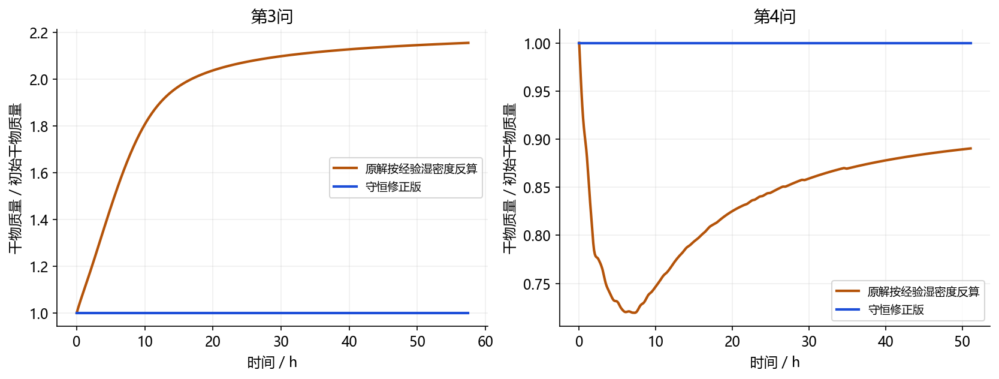
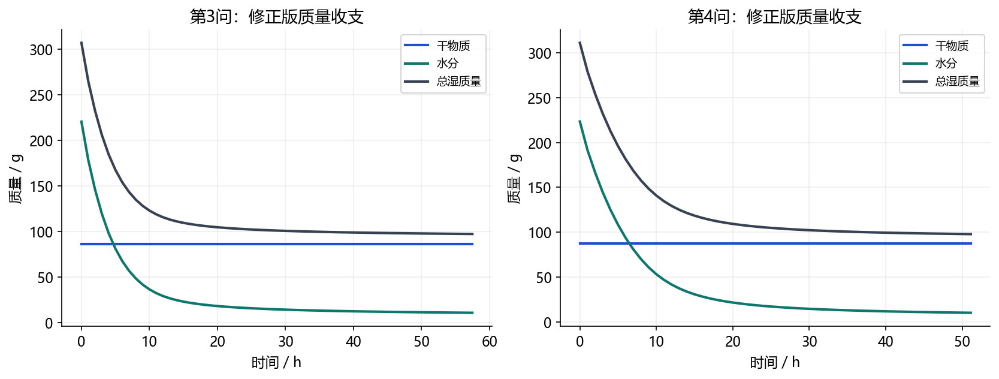
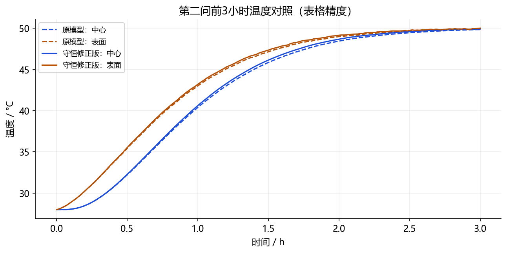

# A题干物质守恒修正版：推导、修改和验证

本轮完成：从干基含水率定义重新建立材料质量收支，修改密度闭合与热量计算，实际重算四问对应输出，并完成本版本的守恒、解析基准、网格与时间求解器检验。原题附件与第一版结果保留。

**适用定位：这是优先满足质量和显热能量守恒的替代闭合模型。它保留题给初始密度、比热、导热、扩散系数及环境/半径数据，但不再把后续经验密度ρ(C)严格当作真实湿体积密度。修正版没有同时满足所有互相冲突的解释，不能隐去这项偏离题给公式的取舍。它也不是经过药材实测标定的工程预测。**

## 1 为什么必须作出密度闭合选择

题给C是kg水/kg干固体；ρ仅称“密度”，未明确是表观湿密度、骨架真密度还是有效热物性。若ρ是湿体积密度，ρd=ρ/(1+C)必须成立。

对于ρ=a+bC，有d[ρ/(1+C)]/dC=(b-a)/(1+C)^2。第三问a=650、b=128，故含水率降低时该干密度反而增加。若每处都干燥、体积固定，则积分干物质量必然增加。这是定义和闭合之间的冲突，不是数值步长引起的误差。第一问固定ρ=820同样不能在失水、固定体积下同时充当真实湿密度。

第四问即使使用给定收缩半径，原解按上述字面密度反算的干物质量仍随时间改变。长度恒为0.25m和内部均匀径向应变均是本模型假设；附件只给外半径，未识别内部应变场。不能从外半径唯一确定骨架力学模型。

本轮选择：以每个材料单元的干物质量不变为硬约束，用初始经验密度确定初始干质量；后续真实湿密度由水量和实际体积推导。经验ρ(C)作为原模型对照，不再作为主修正版后续的真实密度。

## 2 连续方程：先守恒，再写浓度扩散

设v是干固体骨架速度，ρd是每单位当前体积的干物质量，Jw是相对骨架的水分质量通量。

$$\frac{\partial\rho_d}{\partial t}+\nabla\cdot(\rho_d\mathbf v)=0,$$
$$\frac{\partial(\rho_d C)}{\partial t}+\nabla\cdot(\rho_d C\mathbf v+\mathbf J_w)=0,$$
$$\mathbf J_w=-\rho_d D\nabla C.$$

两条连续方程相减，得到

$$\rho_d\frac{D C}{D t}=\nabla\cdot(\rho_d D\nabla C).$$

这里C是比值，收缩不会自动改变该比值。不能给它额外添加-2(R'/R)C作为水分源项。

取x=r/R(t)，固定长度，均匀径向收缩v_r=R'(t)r/R(t)，体积比J=(R/R0)^2。则

$$\rho_d(t)=\frac{\rho_{d,0}}{J(t)},\quad\rho_{d,0}=\frac{\rho(C_0)}{1+C_0},\quad\rho_{\rm wet}(x,t)=\rho_d(t)[1+C(x,t)].$$

在这个特定均匀应变假设下，ρd空间均匀，故浓度方程仍为

$$\left.\frac{\partial C}{\partial t}\right|_x=\frac1{R^2x}\frac{\partial}{\partial x}\left(xD\frac{\partial C}{\partial x}\right).$$

**因此，原模型的浓度方程本身可与干物质守恒兼容；前次审查发现的是把经验ρ同时解释为物理质量密度时的冲突。修正不应通过事后缩放C来伪造质量守恒，也不应重复加入收缩对流项。**

表面采用有效边界通量Jw·n=ρd hm(Cs−Ceq)，单位kg/(m²·s)。这里继续沿用第一版对烘房浓度的“已折算有效平衡边界”假设：4h后取最后1h均值。空气湿度与固体平衡含水率的材料换算仍未获得，不能说本次质量修正已经解决了它。

## 3 离散实现：每个材料单元质量固定

圆柱径向控制体的体积Vi(t)=2πLR(t)^2 wi，wi为无量纲环形权重。令mdi=ρd,0 Vi(0)，求解期间不修改mdi，ρdi=mdi/Vi(t)。水质量直接为mwi=mdi Ci。

计算网格在表面附近加密：x(u)=1−sinh[4(1−u)]/sinh(4)，u在[0,1]均匀取点。各面距离和各控制体体积均按实际非均匀网格计算。这样同时解析早期薄表面层与末期低扩散系数区域，没有通过增加物理参数来改善数值误差。

内部相邻单元只共用一个面质量流率F，水分方程为

$$m_{d,i}\dot C_i=F_{i-1/2}-F_{i+1/2}.$$

逐单元相加，内部面通量严格抵消，只剩外边界排湿：dMw/dt=−Fsurface。总湿质量=M_d+M_w，也随同一外排水量变化。这不是每一步把总质量除回初始值的后处理，局部和整体收支使用同一组物理量。

## 4 热量方程也作一致修改

题给比热可直接代数改写为

$$c_p(C)=\frac{c_s+c_w C}{1+C}.$$

附录3对应cs=1450、cw=4186；附录4对应cs=1850、cw=4000，单位J/(kg·K)。这是题给公式的恒等改写，不是新增拟合参数。第一问的恒定比热用cs=cw=2600保持其公式，属于该问的有效比热近似，不能把2600声称为实测水比热。

每个单元的显热能量取Hi=mdi(cs+cw Ci)(Ti−Tref)，Tref=0°C。表面与内部流动水携带显热；导热流Q使用题给k，水分显热流Ew使用cw(Tface−Tref)F。离散方程为

$$\dot H_i=(Q+E_w)_{i-1/2}-(Q+E_w)_{i+1/2}.$$

代码由这条方程反解温度导数，同时扣除cw(T−Tref)·dC/dt对应的储能变化，避免失水时凭空产生或消失显热。内部面的温度取相邻温度平均；边界排水带走表面温度对应的显热，若吸湿则使用环境温度。热容量使用ρwet cp，不能再混用经验ρ来计算物理储能。

主修正版保持第一版“未显式加入蒸发潜热”的层次，以隔离本次守恒修正；这一点不代表真实干燥无需蒸发热。另运行所有外排水均在表面蒸发的对照，以2.38×10^6 J/kg作为固定潜热假设，其水通量使用修正版实际ρd。内部相态、结合水解吸热、吸附关系、骨架机械功没有被辨识，不能将该对照直接升级为实测准确答案。

## 5 本次实际结果

阈值时刻是max C=0.15的临界时刻；严格小于阈值取其后的第一个整分钟，不以四位小数显示值代替内部判断。下表主修正版均未显式加入潜热。

| 问题 | 原模型临界时间/h | 守恒修正版/h | 变化/s | 修正版首个严格达标整分钟/h |
| --- | ---: | ---: | ---: | ---: |
| 第3问 | 57.474009 | 57.469040 | -17.89 | 57.483333 |
| 第4问 | 51.088513 | 51.108149 | +70.69 | 51.116667 |

临界时长变化较小有物理和数学原因：保持了原有效扩散、半径和表面驱动关系；两版主要在预热期的储热与水分显热计算上不同，后期温度都趋近烘房温度。时长接近不等于修正没有作用，也不能据此判定所有物理假设都准确。



图中橙线是用旧解和“经验ρ为实际湿密度”的解释反算的质量；蓝线是新模型的物理干质量。橙线不能理解为实测干物质损失。





## 6 本版本验证结果

以下为每个时间点、每个控制体按ρwet/(1+C)乘当前体积重新构造干质量的检查。水与能量还分别用独立时间采样的边界通量积分与初末库存差核对。误差不是实测预测误差。

| 问题 | 恒定干物质量/g | 干质量最大相对偏差 | 水分积分残差/kg | 显热积分残差/J |
| --- | ---: | ---: | ---: | ---: |
| 第1问 | 72.566366 | 2.220e-16 | 1.712e-07 | 1.279e-02 |
| 第3问 | 86.407072 | 0.000e+00 | 1.903e-07 | 3.226e-02 |
| 第4问 | 87.566364 | 0.000e+00 | 4.489e-07 | 5.463e-02 |

外部积分分别以10s和5s采样并在4h边界跳变处分段，详细误差见validation.json。控制体干质量恒定是模型结构约束；独立的外边界积分检验用于排除通量单位、面积和时间积分实现错误，不能把构造性恒等式当作实验验证。

还实际完成了：

1. 80、160、320、640、1280五档网格，比较时长及温湿度分布；没有沿用旧版本的收敛结果冒充新结果。
2. 本版本自身的常系数圆柱Robin边界Bessel解析解检验。
3. 第三、四问各自的BDF与Radau求解器对照。
4. 密闭、绝热、仅收缩的极限测试：干物质和水均不跨边界，含水率和温度保持初值，密度随体积缩小增加。该测试直接检验是否错误给干基含水率加入压缩源项。
5. 全场非负性、含水率上界、径向最湿位置以及严格达标整分钟检查。
6. 非零失水、绝热、无显式相变热的极限测试：水带走自身显热后剩余材料应保持28°C。该测试通过，可检验显热通量和储能链式求导是否重复或遗漏。
7. 最后两档网格逐个比较全部导出时刻与半径位置。温度和含水率差均小于0.00005。该检查约束的是网格间差异，不构成四位小数均等于真解舍入值的严格证明。

| 问题 | 网格N | 时间/h | 相邻网格时间差/s | 最大温度差/°C | 最大含水率差 |
| --- | ---: | ---: | ---: | ---: | ---: |
| 1 | 80 | 0.500000000 | — | — | — |
| 1 | 160 | 0.500000000 | 0.000000 | 1.099e-03 | 4.202e-04 |
| 1 | 320 | 0.500000000 | 0.000000 | 3.396e-04 | 1.022e-04 |
| 1 | 640 | 0.500000000 | 0.000000 | 8.112e-05 | 2.541e-05 |
| 1 | 1280 | 0.500000000 | 0.000000 | 1.797e-05 | 6.309e-06 |
| 3 | 80 | 57.468694170 | — | — | — |
| 3 | 160 | 57.468958258 | 0.950717 | 1.039e-03 | 3.831e-04 |
| 3 | 320 | 57.469021101 | 0.226235 | 3.238e-04 | 1.178e-04 |
| 3 | 640 | 57.469036527 | 0.055533 | 7.738e-05 | 2.856e-05 |
| 3 | 1280 | 57.469040481 | 0.014234 | 1.493e-05 | 5.187e-06 |
| 4 | 80 | 51.107577667 | — | — | — |
| 4 | 160 | 51.108007702 | 1.548127 | 1.678e-03 | 6.389e-04 |
| 4 | 320 | 51.108111396 | 0.373299 | 5.216e-04 | 1.919e-04 |
| 4 | 640 | 51.108140555 | 0.104971 | 1.243e-04 | 4.660e-05 |
| 4 | 1280 | 51.108149076 | 0.030677 | 1.881e-05 | 7.700e-06 |

首行“—”表示该问题没有上一档网格可比，不代表求解失败。完整日志保存于results/validation.json，数值检查结果为results/numerical_checks.json。

## 7 消融：区分守恒登记、热容量和相变假设

以下均用N=160，时间差相对于同网格的主守恒修正版。第一行类对照保留原经验热容量，虽可登记恒定干质量，却没有使它与实际热储能保持一致，所以不作为主修正版。

| 问题 | 对照 | 临界时间/h | 相对主修正版变化/s |
| --- | --- | ---: | ---: |
| 第3问 | 保留原经验热容量（仅对照） | 57.473913 | +17.84 |
| 第3问 | 守恒湿密度，仅修正热容量 | 57.467887 | -3.86 |
| 第3问 | 守恒模型+全部表面相变热（额外假设） | 60.429870 | +10659.28 |
| 第4问 | 保留原经验热容量（仅对照） | 51.088366 | -70.71 |
| 第4问 | 守恒湿密度，仅修正热容量 | 51.106575 | -5.16 |
| 第4问 | 守恒模型+全部表面相变热（额外假设） | 56.500974 | +19414.68 |

加潜热对照仍依赖额外界面相变假设；与前版潜热对照的不同还包含ρd换算修正，不能直接把差值全归因于潜热。

## 8 文件与复算

result1.xlsx至result4.xlsx：守恒修正版四份结果表。输出格式、时间采样与原版一致；第二问仍按题目展示的前3h输出逐秒表，整个过程由第三问同参数模型求解；第四问材料外位置留空，另列实际表面值与半径。题面若要求第二问全程逐秒表，应按同一解扩展导出范围。

results/profiles_full_precision.npz：未按四位小数截断的场数据，新增干密度、湿密度和单元干质量。results/mass_history_q*.json：逐小时质量账本。

code/conservative_model.py为修改后的求解器，code/reference_model.py保留原公式供对照。使用requirements.txt对应环境运行：

```text
python code/run_conservation_study.py --cache <临时缓存目录>
python code/check_insulated_drying.py
python code/make_report.py
```

data/reference_baseline.json保存绘图所用旧版结果摘要及其来源文件哈希，因此求解和重绘均不需要访问旧版目录。Excel导出与检查程序另见code目录。数值缓存不包含在交付文件中。

## 9 研究依据与尚未解决的边界

COMSOL关于多孔介质湿传递的官方理论分别讨论固体骨架、液态水和水蒸气的质量及通量，并说明平衡含水率取决于材料吸附/保水关系。本次采用其所强调的分清质量定义的原则，以上简化方程和离散守恒证明由本题定义直接推导：[官方理论](https://doc.comsol.com/6.4/doc/com.comsol.help.heat/heat_ug_theory.07.080.html)。

Gulati与Datta的研究把干燥、固体变形和多相输运耦合，并用温度、含水率与尺寸历史进行实验验证，说明只匹配外半径不足以证明整个热湿模型准确。本次没有借用其土豆材料参数，也没有把其COMSOL计算当作本题软件验证：[作者研究摘要](https://www.comsol.com/paper/multiphase-transport-with-large-deformations-undergoing-rubbery-glassy-phase-transition-applications-to-drying-13714)。

本次解决的是给定几何假设下局部干质量守恒、实际水质量收支和显热收支的一致实现。尚未解决：题给经验密度的权威物理解释、空气到固体的平衡换算、相变热的完整闭合、收缩与含水率的力学反馈、药材内部测量验证。MATLAB、COMSOL、CST均未在本轮实际运行。上述限制需保留，不能因为守恒误差接近机器精度就宣称工程预测同样准确。
