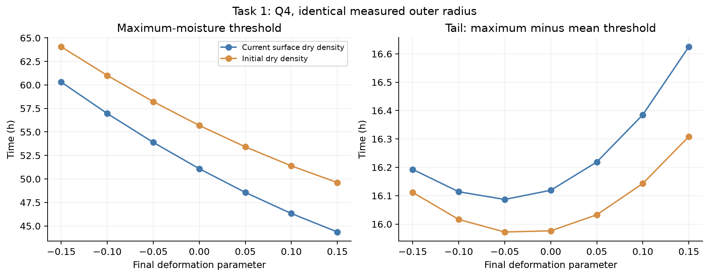
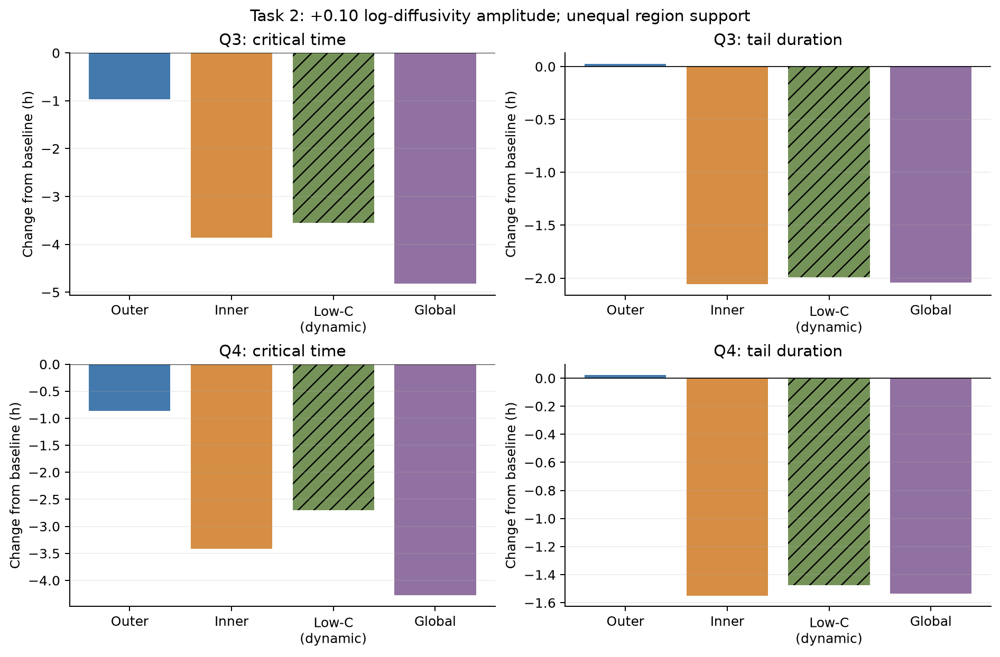
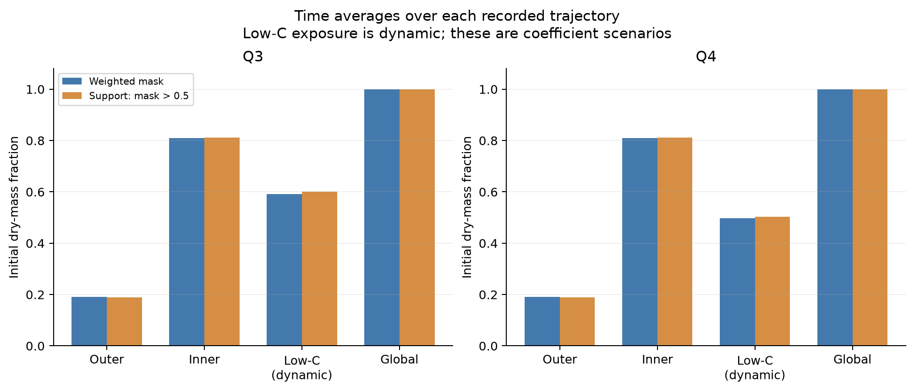

# 从单一烘干时间预测到结构稳健性分析：论文素材

> **模型口径：经验热容量闭合、不计显式汽化热的结构对照。**本批57.47/51.09 h与仓库根说明的守恒显热、计相变热结果属于不同闭合条件。本专题不替代根目录最终分析说明；敏感性和排序结论不得直接搬到相变模型。

本材料基于服务器运行 `20260912_033943_gpu` 的107个已完成情景。图为服务器原始输出，已逐图查看，未重绘或修改；表与文字取自已下载数据。只进行了文件整理及CSV汇总，没有重新求解。文中“任务1/2”是扩展计算任务，Q3/Q4是原题第三、第四问，应在正式论文中改成“变形与边界对照”“扩散扰动试验”，避免混淆。

## 一、建议的论文主线

**基准排序对所测试的扩散系数扰动保持稳定，但会随内部变形与边界定义而改变。**

这条主线比罗列107次仿真更有解释力：先可靠地定义和计算烘干终点，再通过控制变量区分“物性参数扰动”与“结构假设变化”，最后报告结论成立的条件。它是本题的证据组织方式，不是未经文献比较就可以宣称的原创理论。

可选章节标题：**“全域干燥终点的数值验证与模型结构敏感性”**。

摘要可用段落：

> 为避免平均含水率掩盖内部湿区，本文以全域最大干基含水率首次达到阈值定义干燥终点，并采用材料坐标下的径向数值模型开展结构与系数对照。107个情景计算表明，基准Q3和Q4的全域达标时间分别为57.47 h和51.09 h；在45组匹配扩散扰动中，Q4均提前5.49—7.39 h。然而，在相同外半径观测下改变内部变形映射，或改变表面传质通量的密度归一化方式，均会显著改变终点预测，部分情景发生排序反转。结果表明，基准优势不能脱离物理闭合条件推广，内部变形与边界解释应优先于进一步提高数值精度得到检验。

## 二、终点与对照指标：可直接使用的定义

令C(a,t)为干基含水率，a为无量纲材料径向坐标，C*=0.15。定义

$$t_{\max}=\inf\{t:\max_{a\in[0,1]}C(a,t)\le C_*\},\qquad
 t_{\mathrm{mean}}=\inf\{t:\bar C(t)\le C_*\},$$

$$\bar C(t)=\frac{\int C\,\mathrm d m_d}{\int\mathrm d m_d},\qquad
 t_{\mathrm{tail}}=t_{\max}-t_{\mathrm{mean}}.$$

当前数值实现以径向节点最大值近似空间最大值，其精度仍依赖网格收敛；“首次达标”也不自动等价于未来所有时刻都保持达标。

配对变化定义为候选减参照：

$$\Delta t=t_{\max}^{\mathrm{candidate}}-t_{\max}^{\mathrm{reference}}.$$

负值表示加快。新增`data/task2_q3_q4_matched.csv`专门采用Q3减Q4，正值表示Q4更快；该文件列名已明确方向，不能与其他配对表混用符号。

## 三、正文素材A：基准结果与终点差异

> 基准Q3的平均含水率与全域含水率达标时间分别为36.02 h和57.47 h，二者相差21.45 h；Q4分别为34.97 h和51.09 h，相差16.12 h。由此可见，平均含水率达标并不足以代表所有位置完成干燥。基准Q4相对Q3的全域终点缩短约6.39 h（11.11%），但这一比较同时包含物性及几何变化，不能将全部差异单独归因于收缩。

| 情景 | 平均达标/h | 全域达标/h | 间隔/h |
|---|---:|---:|---:|
| Q3固定半径基准 | 36.02 | 57.47 | 21.45 |
| Q4观测收缩仿射基准 | 34.97 | 51.09 | 16.12 |
| Q3施加观测收缩的控制工况 | 17.42 | 25.24 | 7.82 |
| Q4固定半径控制工况 | 85.03 | 129.85 | 44.82 |

固定Q4控制工况允许积分至168 h，故129.85 h不是观测收缩曲线的外推结果。控制工况用于比较数学模型，不代表材料在现实中能够保持该几何而满足全部经验关系。

## 四、正文素材B：相同外半径下，内部变形仍然重要

**建议图注：** 图1 相同观测外半径下，内部变形参数和表面传质密度定义对Q4干燥时间的影响。左图为全域含水率达标时间，右图为全域与平均含水率达标时间之差。蓝色使用当前表面干密度，橙色使用初始干密度。点为已计算情景，连线仅辅助阅读，不代表验证了连续参数域。两子图纵轴均未从零起始，右图尤其采用局部范围显示变化。

> 在当前表面干密度定义下，最终内部变形参数从−0.15变至+0.15时，Q4全域干燥时间从60.30 h降至44.36 h，相对仿射基准的变化约为+18.04%至−13.17%。由于这些情景共用同一外半径曲线，差异表明外轮廓观测不能在本模型族中唯一决定内部迁移过程。进一步地，仿射基准采用初始干密度边界时，终点从51.09 h增至55.69 h，变化4.60 h。相较Q3的57.47 h基准，若干变形及边界组合发生快慢排序反转，因此应将Q4优势表述为有条件的模型结论。

可强调的次要发现：左图终点差异显著，右图尾段时长仅约15.97—16.62 h，且并不随变形参数单调下降。这提示“更早达标”与“平均达标后的等待阶段更短”是不同评价目标；不要依据右图的视觉幅度夸大其变化。

## 五、正文素材C：区域扰动需要公平比较

**建议图注：** 图2 在对数扩散系数扰动幅度+0.10下，Q3和Q4的全域终点及尾段时间变化。内外层采用材料坐标宽度0.10的互补划分；低含水率窗口采用阈值0.20、平滑宽度0.02。纵轴为候选减基准，负值表示缩短。各区域作用范围不等，柱高不能直接当作等剂量局部敏感度。低含水率窗口随状态变化，以斜线区分。

> 将扩散系数写为D_new=D_base exp(delta m)，其中m为区域或状态窗口。在delta=+0.10时，局部最大倍率为exp(0.10)，即约增加10.52%。Q4外层、内层、低含水率窗口及全域扰动分别使终点缩短0.86、3.41、2.70和4.27 h。内层总效应大于外层，但二者的干物质加权作用范围约为81.01%和18.99%，因此总效应排序不能直接解释为局部重要性排序。

**建议图注：** 图3 图2所用正向扰动沿各自计算轨迹的平均作用范围。蓝柱为平滑窗口的干物质质量加权均值，橙柱为窗口大于0.5的干物质占比。低含水率作用范围受求解状态及轨迹终止时间影响，属于事后描述，不是与静态区域同等的外生固定剂量。

用于静态区域的描述性归一化指标可定义为

$$S_m=\frac{t_{\max}(+\delta)-t_{\max}(-\delta)}{2\delta\,\bar m},$$

其中静态窗口的bar m为干物质质量加权范围。当前delta=0.10、宽度0.10下，外层与内层|S_m|的比值在Q3、Q4中分别约为1.063与1.075。因此更恰当的表述是：**在这一归一化与所选窗口下，外层单位作用范围的敏感度略高，但未显示压倒性优势。**有限扰动中心差分不是无穷小导数，归一化也不是严格的等剂量优化试验。

## 六、最值得突出的一组交叉证据

新增对照按扰动类型、幅度、区域宽度、低含水率阈值和平滑宽度逐项匹配Q3/Q4，共45组，全部保持Q4更快，领先5.494—7.386 h。匹配包括基准和确定性参数扫描，不是45个独立统计样本。

| 对照类型 | 本轮发现 | 适合支持的论点 |
|---|---|---|
| 45组匹配扩散扰动 | Q4均更快 | 对所测试系数扰动保持排序 |
| 非仿射内部变形 | 部分Q4超过Q3基准 | 排序对内部结构假设敏感 |
| 两种边界密度定义 | 仿射Q4相差4.60 h | 通量闭合不能作为实现小节略过 |
| 同网格CPU/GPU检查 | 代表终点差小于0.25 s | 已观察到的小时级差异值得作模型层面讨论 |

不能将“45/45”写成“Q4更快的概率为100%”，也不能把三类不同设计范围的最大效应排序当成普适灵敏度排名。

## 七、验证与局限：可直接进入讨论

> 本次计算使用单张H100及双精度CUDA后端，15项验收全部通过。四个全时域代表工况的CPU/GPU终点差绝对值为0.158—0.241 s。该检查针对同网格实现与时间积分，不能代替全情景空间收敛或物理实验验证。独立时间采样通量积分的质量残差绝对值最大约0.0352%，其中包含采样误差。另一方面，经验湿密度关系与几何体积反算的干质量并不总与守恒干质量一致，例如Q4收缩基准比值约0.890。这是物理闭合兼容性的诊断，不能报告成模型实际损失了11%的干物质。

耗时可放附录：验收6.19 min，107个情景主计算47.76 min，合计约53.96 min，未计最后分析。没有与同等工作负载CPU总耗时的完整对照，不能声称某个GPU加速倍数。

## 八、如何让论文更出彩

1. **把“预测一个时间”升级为“交代这个时间何时可信”。**正文依次呈现终点定义、基准值、系数扰动下排序稳定、结构假设下排序翻转。用证据形成逻辑递进。
2. **正文保留图1和图2，图3紧随图2或置于附录并明确引用。**没有图3就容易误读区域柱高。正文用上述交叉证据表连接两项任务，避免堆放107行数据。
3. **把质量守恒和密度兼容性分开报告。**主动解释两种审计量为何不同，会比只展示一个很小的残差更严谨。
4. **以任务3作为下一层检验。**先观察后期温度、有效平衡含水率和扩散形状改变后排序是否保持，再检查联合效应是否能由单因素相加解释。尚未运行的任务3不填数、不提前写“验证了”。
5. **后续优先复核翻转附近，而非盲目加密所有情景。**当前离散结果只定位出可能翻转的区间；若要报告精确临界参数，必须补充局部扫描与空间/时间收敛检查，不能直接把图上线段交点当成精确边界。

建议删去或改写的夸张说法：首次发现结壳规律、证明Q4总是优越、外层绝对主导、GPU大幅加速（无公平对照）、H100计算证明物理正确。现有证据足以支持一篇认真讨论条件与稳健性的建模论文，无需这些包装。

## 九、文件说明

- `论文素材.tex`：独立中文LaTeX稿，图表和核心讨论已嵌入，适合整合到正式论文。此次未编译PDF；可在已有TeX环境中选择XeLaTeX。
- `figures/`：三张服务器原图，图中文字保留英文，中文图注见正文。
- `data/`：原始汇总及各配对表，新增45组Q3/Q4配对表。
- `verification/`：验收、运行清单、环境与解释记录。
- `详细数值解读.md`：更完整的逐项数字。
- `实验设计.md`、`复现与取用.md`：公开实验说明、数据字段、复算命令及模型边界。任务3尚未产生本专题的结果，不作为本批已完成实验交付。

数据来源与记录时间：2026-09-12。没有补造实验数据、置信区间或参考文献；正式论文中的文献综述应继续使用已经核实的文献来源。
