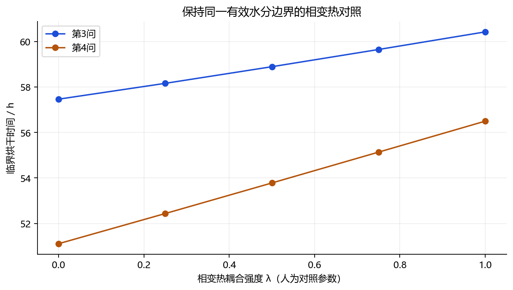
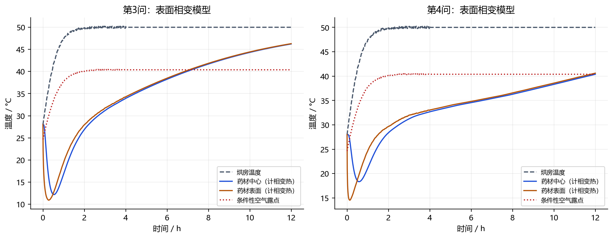

# 相变热、平衡含水率与露点分析

本专题保留相变热耦合、温变潜热、能量积分及露点诊断的完整表格。数值收敛不消除有效湿度边界的条件性，正文必须与本专题一起保留这些解释。

计算数据和代码位于 `计算与证据/相变机理`；正文中的data、results及code均指该专题计算目录。

## 1 “平衡湿度”具体指什么

此前的说法不够精确：这里应称“药材平衡含水率”Ceq。它是药材在给定温度和空气湿度下，经过足够长时间，不再净吸水或净失水时的干基含水率。它不是空气相对湿度，也不是每千克干空气所含的水蒸气质量。

- 药材C：kg水/kg干药材。
- 空气含湿量W：若按常用湿空气定义，是kg水蒸气/kg干空气。
- 空气相对湿度RH：水蒸气分压与该温度饱和蒸气压之比，无量纲。

两种kg/kg分母不同，不能直接当作同一变量相减。原题明确药材浓度是干基含水率，但没有进一步解释烘房“水分浓度”的换算。经验闭合模型把烘房数值当作已经折算的有效Ceq，这是一项需要说明的简化假设。

**条件性换算**：假设附件空气浓度就是W，气压为101325 Pa，并使用理想湿空气关系

$$p_v=\frac{PW}{0.621945+W},\qquad RH=\frac{p_v}{p_{sat}(T_a)}.$$

后期Ta=49.99893°C、W=0.04998754对应RH约61.03%，露点约40.38°C。这不能推出药材Ceq=0.05；还缺少药材的解吸等温线，通常表示为Ceq=f(T,RH)，或水活度aw=g(C,T)。湿空气定义与换算依据：[ASHRAE湿空气学](https://handbook.ashrae.org/Handbooks/F25/SI/F25_Ch01/F25_Ch01_si.aspx)。

## 2 相变热如何加入

采用“所有净排出水都在表面汽化”的简化对照。在守恒守恒模型中，实际表面水质量流率为

$$\dot m_w=A_s\rho_d h_m(C_s-C_{eq})\quad[\mathrm{kg/s}],$$
$$P_{evap}=\lambda L_v\dot m_w\quad[\mathrm W].$$

λ=0是原显热基准，λ=1为全部表面汽化热耦合，0.25、0.5、0.75用于检查影响随耦合强度的变化；λ不是实测蒸发比例，也不是置信概率。真实干燥不能解释为其余水无须汽化热，它只是模型对照参数。

表面能量条件为

$$-k\partial_nT=h(T_s-T_a)+\lambda L_vj_w.$$

内部仍用守恒守恒模型的水分显热通量与干固体/水储能。相变热只加入一次，不再在整个体积中重复扣除Lv·dC/dt。主对照Lv=2.38×10^6 J/kg；另外按IAPWS饱和水物性计算Lv(Ts)，比较固定潜热的近似影响。

物理机制：汽化消耗热量，使药材低于烘房温度；题给D随温度下降而减小，后续水分迁移变慢，延长达标时间。

## 3 实际计算影响

下表两列共用干物质守恒密度、有效水分边界、半径、传热传质系数，仅改变是否加入汽化热。临界条件为全场最大C=0.15；严格低于阈值取临界时刻之后。

| 问题 | 不计显式相变热/h | 计全部表面相变热/h | 延长/h | 增幅 |
| --- | ---: | ---: | ---: | ---: |
| 第3问 | 57.4690 | 60.4300 | 2.9610 | 5.15% |
| 第4问 | 51.1081 | 56.5012 | 5.3930 | 10.55% |

该对照说明相变热对当前模型不可忽略，不能直接据此认定右列为真实药材的准确时长。它仍依赖有效边界和表面相变位置假设，且存在下述热力学解释冲突。



| 问题 | λ | 同网格N=160临界时间/h | 相对λ=0变化 |
| --- | ---: | ---: | ---: |
| 第3问 | 0.00 | 57.468958 | 0.000% |
| 第3问 | 0.25 | 58.165586 | 1.212% |
| 第3问 | 0.50 | 58.897449 | 2.486% |
| 第3问 | 0.75 | 59.654932 | 3.804% |
| 第3问 | 1.00 | 60.429870 | 5.152% |
| 第4问 | 0.00 | 51.108008 | 0.000% |
| 第4问 | 0.25 | 52.435237 | 2.597% |
| 第4问 | 0.50 | 53.780980 | 5.230% |
| 第4问 | 0.75 | 55.137992 | 7.885% |
| 第4问 | 1.00 | 56.500974 | 10.552% |

按临界时刻之后的第一个整分钟取值，第三问为60小时26分，第四问为56小时31分。这对应固定汽化潜热2.38 MJ/kg的主对照；温变潜热结果另列于第6节。

温度对照如下，均为实际计算值；中心、表面及平均含水率等关键量的更详细时间序列见results/history_q3.json与history_q4.json。

| 问题 | 时间/h | 无相变热中心/°C | 有相变热中心/°C | 无相变热表面/°C | 有相变热表面/°C |
| --- | ---: | ---: | ---: | ---: | ---: |
| 第3问 | 0.5 | 32.245 | 12.226 | 35.498 | 12.471 |
| 第3问 | 1.0 | 40.601 | 16.852 | 43.190 | 19.462 |
| 第3问 | 3.0 | 49.912 | 31.163 | 50.011 | 31.741 |
| 第3问 | 4.0 | 50.012 | 33.926 | 50.006 | 34.289 |
| 第3问 | 6.0 | 49.999 | 38.252 | 49.999 | 38.492 |
| 第3问 | 12.0 | 49.999 | 46.224 | 49.999 | 46.292 |
| 第3问 | 24.0 | 49.999 | 49.534 | 49.999 | 49.537 |
| 第4问 | 0.5 | 30.729 | 18.534 | 35.772 | 18.757 |
| 第4问 | 1.0 | 37.976 | 21.137 | 42.722 | 24.696 |
| 第4问 | 3.0 | 49.448 | 31.241 | 49.799 | 31.986 |
| 第4问 | 4.0 | 49.917 | 32.684 | 49.967 | 33.057 |
| 第4问 | 6.0 | 49.998 | 34.562 | 49.998 | 34.807 |
| 第4问 | 12.0 | 49.999 | 40.380 | 49.999 | 40.606 |
| 第4问 | 24.0 | 49.999 | 48.131 | 49.999 | 48.168 |

第一问另作了30分钟对照：中心温度由33.717°C变为11.220°C，表面由36.973°C变为12.708°C。由于附录2的D只依赖C而不依赖T，两次含水率解的最大差仅2.079e-07，符合其方程结构。这些大幅降温同样只能作为旧有效边界下的机理对照，不能解释为真实药材在当前湿空气中就会降到这些温度。

## 4 发现的物理一致性问题：不能只加潜热就定稿

在“附件浓度是真实空气含湿量”的解释下，常规界面传质的驱动方向应由aw(C_s,T_s)psat(T_s)−pv决定。对于常规稳定液态/吸附水界面，aw不超过1。若T_s低于空气露点，则psat(T_s)<pv，即使按纯水表面aw=1，也不具备净向外蒸发的正驱动力。

本研究发现，现有有效浓度边界在部分时段仍规定向外排水，同时潜热把表面温度压到上述露点以下。因此它在此空气解释下有符号一致性冲突。这不是浮点误差，也不是需要更细网格才能解决的问题。

| 问题 | 采样最低表温/°C | 最低值时间/h | 向外排水且低于条件性露点的时段 | 最大pv/psat(Ts) |
| --- | ---: | ---: | --- | ---: |
| 第3问 | 10.913 | 0.283 | 0.002–7.067 h | 3.543 |
| 第4问 | 14.551 | 0.133 | 0.001–11.784 h | 2.396 |

最后一列大于1意味着要维持零净驱动力都需要超出通常范围的水活度，更不用说正蒸发通量。时段先按30s/60s采样定位，再用根求解细化交点；最低温度仅是采样最低值，不声称求得连续时间的严格全局最小值。



这项诊断始终附带标准气压、W的真实空气解释、常规表面传质等假设；如果题面本就定义了有效折算浓度，就不能把该露点条件当成对题设模型的无条件否定。它说明真正工程模型需要同时处理湿度驱动力和相变热。

建议的完整边界形式为j_w=β_p[aw(C_s,T_s)psat(T_s)−pv]，并将同一个j_w用于质量和潜热。当前没有药材aw关系，也没有明确的气膜系数β_p；题给hm不能不经单位和定义换算就直接代入压差形式。不能通过猜药材种类、随意套其他材料参数来得到“唯一精确答案”。COMSOL也用水活度与饱和蒸气条件建立相变耦合：[官方建模说明](https://www.comsol.com/blogs/how-to-model-heat-and-moisture-transport-in-porous-media-with-comsol)。

## 5 能量与质量核算

使用独立时间采样积分核对

$$\Delta H=Q_{conv,in}-Q_{latent}-H_{water,out}.$$

表中Qconv仅是对这根模型药材的对流供热积分，不能当作整间烘房或整台设备耗电；没有包括热风发生、排风、设备和围护结构损失。

| 问题 | 对流供热/kJ | 汽化热/kJ | 流出水显热/kJ | 储存显热变化/kJ | 收支残差/J |
| --- | ---: | ---: | ---: | ---: | ---: |
| 第3问 | 506.990 | 498.841 | 28.980 | -20.831 | 1.3996 |
| 第4问 | 517.081 | 506.765 | 29.721 | -19.403 | 2.3723 |

详细数据同时保留10s、5s积分结果；在4h环境切换点分段。干物质量也逐时按保存的密度和体积重建验证，继续保持恒定。

## 6 数值与水物性验证

| 问题 | 网格N | 临界时间/h | 相邻网格差/s | 最大温度差/°C | 最大含水率差 |
| --- | ---: | ---: | ---: | ---: | ---: |
| 第3问 | 160 | 60.42986952 | — | — | — |
| 第3问 | 320 | 60.42997041 | 0.363213 | 1.285e-03 | 1.386e-04 |
| 第3问 | 640 | 60.42999543 | 0.090078 | 3.920e-04 | 4.405e-05 |
| 第3问 | 1280 | 60.43000162 | 0.022267 | 9.240e-05 | 1.028e-05 |
| 第4问 | 160 | 56.50097443 | — | — | — |
| 第4问 | 320 | 56.50113558 | 0.580115 | 9.385e-04 | 1.157e-03 |
| 第4问 | 640 | 56.50117766 | 0.151491 | 2.699e-04 | 2.798e-04 |
| 第4问 | 1280 | 56.50119000 | 0.044446 | 6.381e-05 | 6.941e-05 |

时间求解器BDF与Radau在同一N=160下分别复核第三、四问。网格表中的分布差覆盖早期、3h、4h及后续多个时点，不冒称检查了所有可能的时空位置。完整数值证据见results/study.json。

水的饱和蒸气压、两相密度及温变汽化潜热按照IAPWS SR1-86(1992)计算，以Clapeyron关系Lv=T(dp_sat/dT)(1/ρv−1/ρl)求两相焓差，并与发布文件第7页三个温度的检查表对照通过。Lv(28°C)=2.43476 MJ/kg，Lv(50°C)=2.38200 MJ/kg。[IAPWS官方文件](https://iapws.org/technical-guidance/release/Supp-sat)。

| 问题 | 固定Lv，同网格/h | IAPWS Lv(Ts)，同网格/h | 变化/min |
| --- | ---: | ---: | ---: |
| 第3问 | 60.429870 | 60.475979 | +2.767 |
| 第4问 | 56.500974 | 56.569544 | +4.114 |

这只是纯水汽化潜热的温度依赖，未包含药材结合水解吸热。题给有效比热仍沿用守恒守恒模型的解释，不能将这项物性改进等同于完整多相热力学模型。

## 7 复算与结果定位

code/study_latent.py实际运行本研究计算，water_thermo.py为经表值核验的水物性实现，latent_model.py提供温变潜热对照。运行环境为本机Python，不是COMSOL/CST/MATLAB。本目录包含输入副本，默认不会覆盖经验闭合模型文件。

```text
python ../计算与证据/相变机理/code/study_latent.py --cache <温变潜热临时缓存> --baseline-cache <模型临时缓存>
python ../计算与证据/相变机理/code/check_first_question.py --cache <模型临时缓存>
python ../计算与证据/相变机理/code/make_latent_report.py
```

模型临时缓存可复用显热守恒分析缓存，也可为空目录。第一次运行会计算全部对照。本研究交付为相变热影响与边界诊断，不输出论文，也不把条件性结果替换为题设唯一答案。
